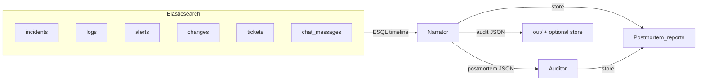

# Elastic Postmortem AI

[](https://opensource.org/licenses/MIT)
[](https://www.python.org/downloads/)
[](https://www.elastic.co/)
[](https://streamlit.io/)
[](https://render.com/)

**Evidence-linked incident post-mortems with integrity scoring.** Elasticsearch holds the timeline; a Narrator agent produces claims tied to refs; an Auditor validates those refs, scores decision integrity, and flags governance issues. All deterministic and versionable.

---

## 30-second demo

```bash
make setup          # venv + pip install (mac/Linux)
# Set ES_URL + ES_API_KEY in .env
make indices        # create indices
make load           # bulk load synthetic data
make demo           # narrator → auditor for INC-1042
make ui             # Streamlit app
```

git **Windows (PowerShell):** same flow with `python -m venv venv`, `.\venv\Scripts\Activate.ps1`, `pip install -r requirements.txt`, then `python scripts/create_indices.py --recreate`, `python scripts/bulk_load.py`, `python scripts/run_e2e.py --incident INC-1042`, `streamlit run app.py`.

---

## What makes it different

- **Evidence-linked claims** — Every claim points at timeline refs (logs, changes, tickets). No free-form narrative without a trace.
- **Decision integrity** — Change/approval records are extracted and scored (who approved what, in/out of window). Auditor detects governance violations (e.g. overstrong causality).
- **Deterministic scores** — Same timeline → same post-mortem and audit. No API calls required (mock mode); optional OpenAI for richer text.
- **Versioned artifacts** — Narrator and audit reports can be stored in Elasticsearch (narrator_report / audit_report) with versions for audit trail.

---

## Architecture



- **Narrator:** Loads incident context (ES|QL over logs, alerts, changes, chat, tickets), enriches change summaries, produces post-mortem (summary, claims with evidence_refs, decision_integrity_artifacts).
- **Auditor:** Validates refs against Elasticsearch, challenges unsupported claims, scores overall + decision integrity, emits governance findings.

---

## Data model (indices)

| Index | Purpose |
|-------|---------|
| `pmai-incidents` | Incident metadata |
| `pmai-logs` | Log events |
| `pmai-alerts` | Alerts |
| `pmai-changes` | Changes / deployments / approvals |
| `pmai-chat_messages` | Chat (e.g. Slack) |
| `pmai-tickets` | Tickets (e.g. Jira) |
| `pmai-metrics` | Metrics |
| `pmai-runbook_policies` | Runbook / policy definitions |
| `pmai-postmortem_reports` | Stored narrator_report + audit_report (versioned) |

Prefix `pmai` is from `ES_INDEX_PREFIX` (default `pmai`).

---

## Runbook

1. **Setup** — `python -m venv venv`, activate, `pip install -r requirements.txt`. Copy `.env.example` to `.env`, set `ES_URL` and `ES_API_KEY` (Elasticsearch Serverless).
2. **Indices** — `python scripts/create_indices.py --recreate` (uses `mappings/*.json`).
3. **Load** — `python scripts/bulk_load.py` (loads from `data/`).
4. **Demo** — `python scripts/run_e2e.py --incident INC-1042` → `out/postmortem_*.json`, `out/audit_*.json`, console executive summary.
5. **UI** — `streamlit run app.py` → Generate post-mortem, Run audit, view Timeline / Post-mortem JSON / Audit JSON / Stored Artifacts. Check “Store outputs to Elasticsearch” to version artifacts.

**Make (mac/Linux):** `make setup`, `make indices`, `make load`, `make demo`, `make ui`; `make verify` runs `scripts/verify_e2e.py`.

---

## Agent Builder mode

If `KIBANA_URL` and `KIBANA_API_KEY` are set in `.env`, the Streamlit app will call **Kibana Agent Builder** for the Narrator and Auditor. Otherwise it uses the local deterministic pipeline (no Kibana required).

- **Env vars:** `KIBANA_URL`, `KIBANA_API_KEY`; optional: `AGENT_NARRATOR_ID` (default `incident-narrator-agent`), `AGENT_AUDITOR_ID` (default `incident-integrity-auditor`), `AGENT_TIMEOUT_SECS` (default `60`).
- **Fallback:** If the agent call fails or env is missing, the UI falls back to the local narrator/auditor and shows a short warning.
- **Smoke test:** From repo root: `python -m scripts.agent_smoke_test` (checks config and calls the narrator agent for INC-1042; prints first 200 chars of JSON).

**How to get these values**

| Variable | How to get it |
|----------|----------------|
| **KIBANA_URL** | **Elastic Cloud:** Deployments → your deployment → Kibana → copy the URL (e.g. `https://<deployment>.kb.<region>.gcp.cloud.es.io`). No port needed if using default HTTPS. **Self‑hosted:** Your Kibana base URL (e.g. `https://kibana.example.com`). |
| **KIBANA_API_KEY** | **In Kibana:** Help (?) → **Connection details** → **API key** → Create API key (name it, copy the key). Or: **Management** → **API keys** → Create. Use the encoded string (ID:key) as `KIBANA_API_KEY`. Same API key used for Elasticsearch often works for Kibana API if it has Kibana access. |
| **AGENT_NARRATOR_ID** | ID of the **Narrator** agent in Kibana Agent Builder (e.g. **Machine Learning** → **Agent Builder** or **Search** → **Agent**). Use the agent’s ID/slug from the agent config or URL. Default `incident-narrator-agent` if you named the agent that. |
| **AGENT_AUDITOR_ID** | ID of the **Auditor** agent in Agent Builder. Default `incident-integrity-auditor`. |
| **AGENT_TIMEOUT_SECS** | Optional. Seconds to wait for the agent chat API (default `60`). Increase for slow agents. |

**Test agent connectivity (curl):** Uses the Kibana 9.2+ Agent Builder converse API.
```bash
curl -s -X POST "${KIBANA_URL}/api/agent_builder/converse" \
  -H "Authorization: ApiKey ${KIBANA_API_KEY}" -H "kbn-xsrf: true" -H "Content-Type: application/json" \
  -d '{"agent_id":"incident-narrator-agent","input":"Output only: {\"ok\":true}"}'
```

---

## Deploy to Render

Deploy the Streamlit UI as a Render Web Service (zero code logic changes).

1. **Connect the repo** to Render and create a **Web Service** from the repo. Render will detect `render.yaml` (Blueprint).
2. **Environment variables** (required in Render Dashboard → Service → Environment):
   - **ES_URL** — Your Elasticsearch endpoint (e.g. `https://….es.<region>.gcp.cloud.es.io`).
   - **ES_API_KEY** — API key for Elasticsearch Serverless.
   - **ES_VERIFY_TLS** — Optional; set to `false` if your cluster uses self-signed or internal certs (default `true`).
3. **Deploy** — Render runs `pip install -r requirements.txt` then `streamlit run app.py --server.port $PORT --server.address 0.0.0.0`. Health checks use path `/`.

**Run locally (same app):** `streamlit run app.py` (with `ES_URL` and `ES_API_KEY` in `.env`). Use `make ui` after `make setup` if you use the Makefile.

---

## License

MIT — see [LICENSE](LICENSE).
