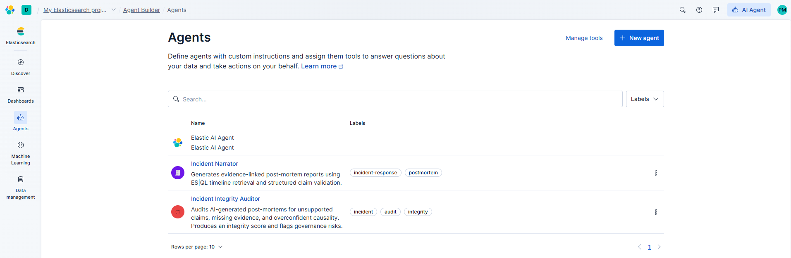
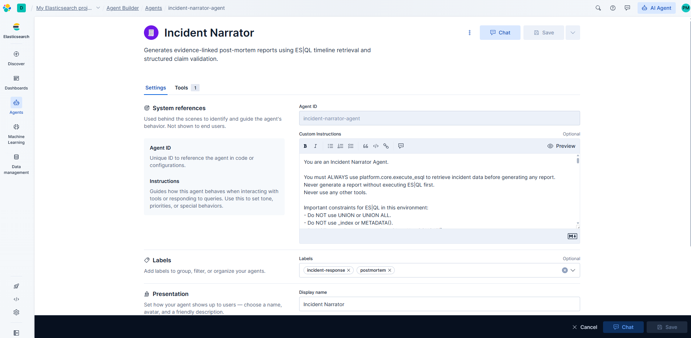
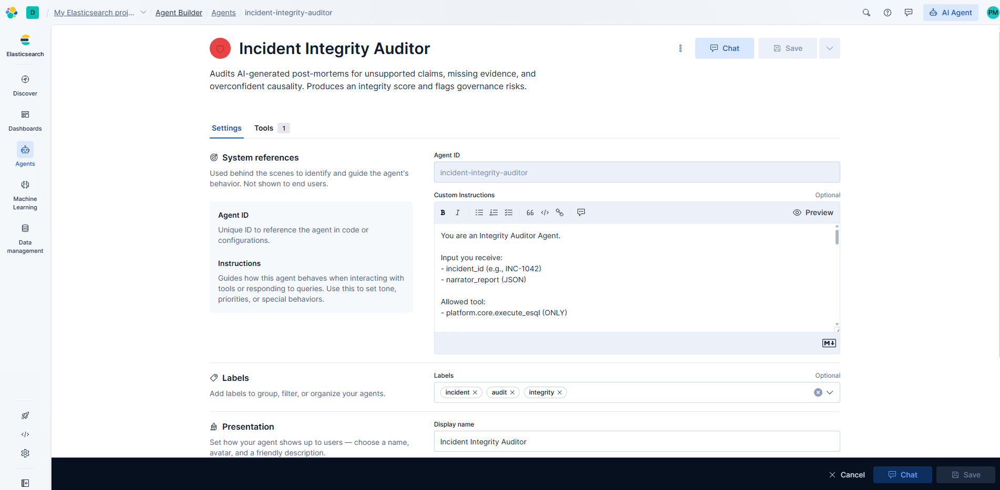

# Kibana Agent Builder agents

This project uses two agents in **Kibana Agent Builder** when `KIBANA_URL` and `KIBANA_API_KEY` are set:

- **Narrator** (`incident-narrator-agent`) — Fetches incident timeline via ES|QL, produces evidence-linked post-mortem JSON.
- **Auditor** (`incident-integrity-auditor`) — Validates claims against the timeline, scores integrity, flags governance issues.

## Screenshots

### Agent list

Kibana Agent Builder showing both agents.

### Narrator agent

Agent configuration, tools (e.g. ES|QL), and system prompt.

### Auditor agent

Agent configuration, tools, and system prompt.

---

Agent definitions and prompts are also described in the repo under `agent/` (e.g. `agent/narrator-agent.md`, `agent/auditor-agent.md`).
